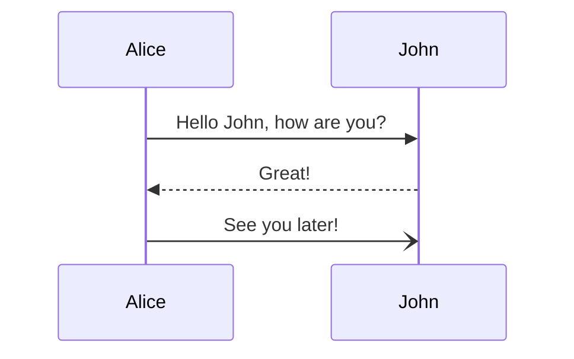

```javascript
export default () => {
console.log('Code block')
}
```

```ruby
puts "hello, world"
puts "yes"
```

---



---

```
@startuml firstDiagram

Alice -> Bob: Hello
Bob -> Alice: Hi!

@enduml
```
