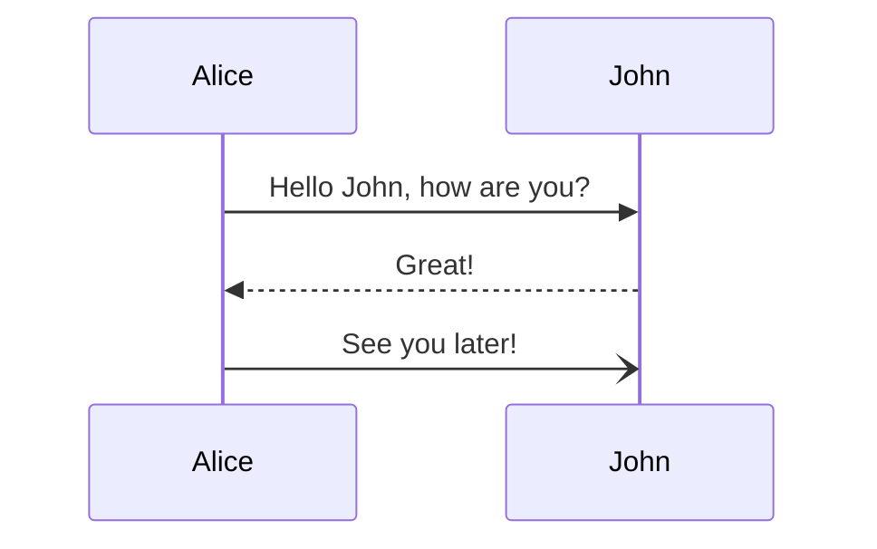

# Code Higihting Style Test

```javascript
console.log('Hello, JavaScript')
```

```ts
console.log 'Hello, TypeScript'
```

```vue
<script>
export default {
  data() {
    return {
      count: 0
    }
  }
}
</script>

<template>
  <button @click="count++">Count is: {{ count }}</button>
</template>

<style scoped>
button {
  font-weight: bold;
}
</style>
```

```ruby
puts "Hello, Ruby"
```


